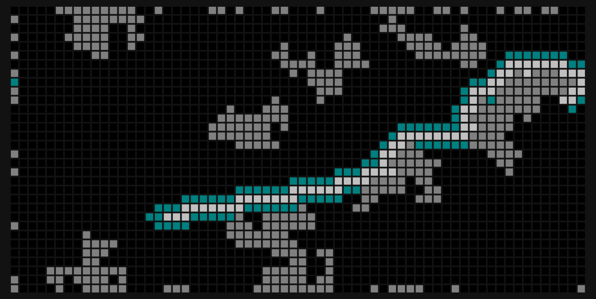

# wasm_party
Here is the code I made while learning to use WebAssembly.
It runs and visualizes a pathfinding algorithm in the browser.

## Run online
Click this link: [github.io/pathfinding_wasm](https://askeladd123.github.io/pathfinding/).
Requires JavaScript and WebAssembly support; should work in most browsers.

---

## Run locally
To run locally you need a browser with JavaScript and WebAssembly support, and
[wasm-pack](https://github.com/rustwasm/wasm-pack) and 
[npm](https://docs.npmjs.com/downloading-and-installing-node-js-and-npm) 
installed on your computer.
Run these commands from terminal, from this folder:
* ```wasm-pack build```
* ```npm install```

Now you have two options:
1) ```npm run start``` to run the program in [localhost:8080]()
2) <s>```npm run build``` to pack then open ***dist/index.html*** in a browser</s>

## Potential problems
```wasm-pack build``` in short for ```wasm-pack build --target bundler```.
This may change in the future. Consider using the second one.

I use *Windows 11*. I had trouble with *npm 17*, 
so I used *npm 16* instead.
